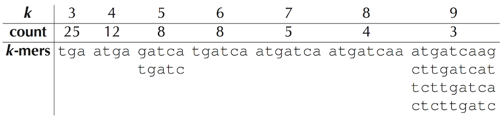

## Where in the Genome does replication begin

Genome Replication is one of the most important tasks carried out in the cell. Before a cell can divide it has to replicate it's genome so thjat each of the two daughter cells inherits its own copy.

Figure: A naive view of replication. Nucleotides adenine (A) and thymine (T) are complements of each other, as are cytosine (C) and guanine (G). Complementary nucleotides bind to each other in DNA.

Though this image shows a simplistic model, the details are much more complex.

Mimcing this process programmatically would just involve taking a string of genome and just making a copy of it. However by looking at the underlying biological process, it is much more complex. Replication begins at points called __*Ori* (replication origin)__. and is carried out by enzymes called __DNA polymerases__.

Locating the *ori* is not only needed to understand how cells replicate but helps in saolving various biomedical problems eg __gene therapy__. This method involves injecting genetically engineered mini-genomes known as __viral vectors__. The idea is to intentionally infect a patient lacking a crucial gene with a viral vector containing an artifical gene capable of encoding the theurapetic protein. Once in the cell, this viral protein replicates and produces several copies of the needed protein treating the patient's illness. In order for this process to be successfully carried out, the *ori* of the vetor genome need to be found.

Problem: __Finding the origin of replication__
- Input: A DNA string _Genome_
- Output: The location of _ori_ in _Genome_

More information is needed before this can be solved computationally.

We would be focusing on finding the _ori_ in baterial DNA (Single circular DNA). The genome of a bacterial DNA (_Vibrio cholerae_) with known _ori_ location would be studied to determin what makes the genomic region special.

There is definitely a hidden message telling the cell to begin replication in the 1,108250 nucleotides present in the chromosome of Vibrio Cholera. We know that replication is mediated by an enzyme known as __DnaA__ and this protein bind to a short nucleotide sequence in the _ori_ known as ___DnaA box___. 

### Counting Words
We would be finding frequent sequences in a genome. We looking for frequent words in th _ori_ because, for various biological processes, certain nucleotide strings often appear surprisingly often in small regions of the genome. This is often because certain proteins can only bind to DNA if a specific string of nucleotides is present, and if there are more occurrences of the string, then it is more likely that binding will successfully occur. (It is also less likely that a mutation will disrupt the binding process.)

**Code Challenge**: Implement PatternCount (reproduced below).  
**Input**: Strings Text and Pattern.  
**Output**: Count(Text, Pattern).  

To do this we would implement the [`PatternCount`](./pattern_count.py) function

### Frequent words problem
What if we have more than one frequent word, how do we find them. We can search a string to find all frequent words.

**Frequent Words Problem**: Find the most frequent k-mers in a string.  
**Input**: A string Text and an integer k.  
**Output**: All most frequent k-mers in Text.  

Using the frequent words algorithm on the _ori_ of _Vibrio Cholerae_ we can find out that the 9-mer __ATGATCAAG__ occurs 3 times. Also, 3 other 9-mers are frequently occuring.

### Surprising messages
When we look at the frequently occuring 9-mers in the _ori_ of _Vibrio Cholerae_. One of them is complementary to the other making this more surprising.

Analysing the genome of another bacterium _Thermotogo petrophilia_, another set of 9-mers is frequently occuring.

## Clump Finding Problem
In other bacteria genomes it is unlikely that we find the the 9-mers. So we need to find closey-frequently occuring `k-mers`.

**Clump Finding Problem**: Find patterns forming clumps in a string.  
**Input**: A string Genome, and integers k, L, and t.  
**Output**: All distinct k-mers forming (L, t)-clumps in _Genome_  

**Solution**: [Clump Finder](./clum_finder.py)
