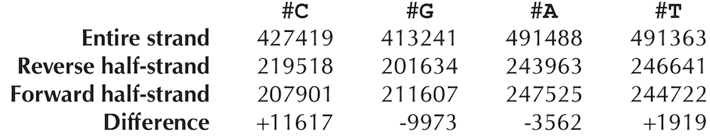
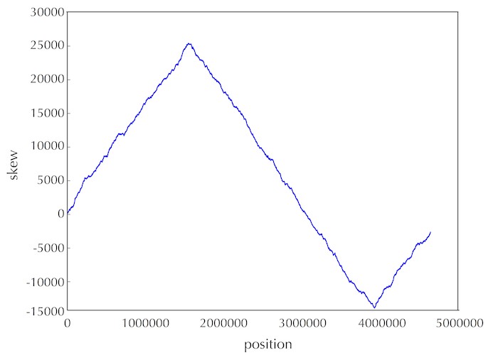

## Finding Replication Origins

> You should understanding [replication](https://www.thoughtco.com/dna-replication-3981005)

We will use the asymmetry of replicatioon to possibly help locate the origin of replication.

### Deamination
Asymmetry of replication means that both strands of the DNA replicate at different speeds. The forward (leading) strand are transversed in 5' to 3' direction from the _ori_ to the _ter_ while the reverse strand moves in the 3' to 5' direction. _Okazaki fragments_ and all that shenanigans...

The forward strand moves slower because of the presence of __Okazaki__ fragments during replication which are absent in the reverse strand.

This is important because, ssDNA (single-stranded DNA) has a higer chance of being mutated compared to dsDNA (double-stranded DNA). Hence a nucleotide which mutates easily would have a shortage in its composition in ssDNA

__Nucleotide composition of Thermotoga petrophilia__

From the image above, C-G tend to have a higher amount of disparity than A-T. There is a much lower composition of C  in the forward half strand due to Deamination - the mutation of Cystosine (C) into Thymine (T).[^1]

### The skew diagram

By calculating the difference between proportion the G and C nucleotides, we can be able to determine the position of the _ori_. We can transverse the genome, keeping a total of the differences between the counts on G and C. When the difference starts __increasing__, we can guess that, we are on the __forward half strand__, on the other hand if the difference decreases, we are on the __reverse half strand__. The point at which the difference between the G and C count switches from dereasing to increasing is likely the position of the __ori__ 

**Skew diagram of _E.coli_**

### Minimim Skew
**Minimun skew Problem:** Find the point in a given genome where the `G-C` skew attains its minimum  
**Input:** A genome  
**Output:** points where skew is at minimum

[`solution`](./minimum_skew.py)

We can assume that solving the minimum skew problem helps find the approximate position of the _ori_. Applying this in the _ori_ region of _E. Coli_, this does not seem to be the case as we do not find frequently occuring 9-mers.  
Before giving up, we can find frequent 9-mers that differ by only one nucleotide.
- 3 occurences of **ATGATCAAG** 
- 3 occurences of the reverse compliment: **CTTGATCAT**
- addtional occurences **ATGATCAA**C, **C**A**TGATCAT** differing by one nucleotide

**Hamming distance problem**: Tha haming distance is the number of mismatches found in nucleotides of the same length  
**Input:** Two nucleotides of the same length  
**Output:** The hamming distance between the nucleotides  
**Sample Input:**  
GGGCCGTTGGT  
GGACCGTTGAC  
**Sample Output:**  
3

[**`Solution`**](./hamming_distance.py)

**Approximate pattern matching**: We can find approximate nucleotides (nucleotides within a given _Hamming distance_) in a given section of a genome - Countd(Text, Pattern)   
**Input:** nucleotide, genome segment, hamming distance,  
**Output:** Starting positions of the nucleotide within the given hamming distance   
**Sample Input:**    
ATTCTGGA  
CGCCCGAATCCAGAACGCATTCCCATATTTCGGGACCACTGGCCTCCACGGTACGGACGTCAATCAAAT  
3  
**Sample Output:**  
6 7 26 27  
[**`Solution`**](./approximate_pattern_match.py)
  
We can then modify the pattern count algorithm to find pattern with mismatches, where d is the hamming distance

**ApproximatePatternCount**  
**Input:** Strings Pattern(nucleotide) and Text (genome segment) as well as an integer d.  
**Output:** Number of occurences of nucleotide withing the given hamming distance.  
[**`Solution`**](./approximate_pattern_count.py)
  
We can also then find
**Frequent Words with Mismatches Problem:** Find the most frequent k-mers with mismatches in a string.

**Input:** A string Text as well as integers k and d. (You may assume k ≤ 12 and d ≤ 3.)  
**Output:** All most frequent k-mers with up to d mismatches in Text.
[**`Solution`**](./frequent_kmer_mismatch.py)

  
**Frequent Words with Mismatches and Reverse Complements Problem:** Find the most frequent k-mers (with mismatches and reverse complements) in a string.
  
**Input:** A DNA string Text as well as integers k and d.  
**Output:** All k-mers Pattern maximizing the sum Countd(Text, Pattern)+ Countd(Text,  Patternrc) over all possible k-mers.
[**`Solution`**](./frequent_kmer_mismatch_with_reverse.py)

[^1] It is argued that deamination is not the only/dominant factor responsible for the G-C skew [Frank and Lobry, 1999](http://dx.doi.org/10.1016/S0378-1119(99)00297-8), [Tillier and Collins, 2000](http://www.ncbi.nlm.nih.gov/pubmed/10754068)
