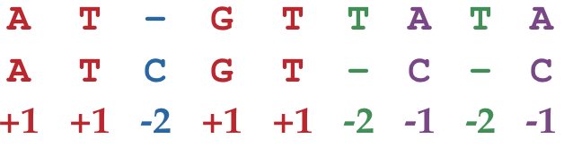
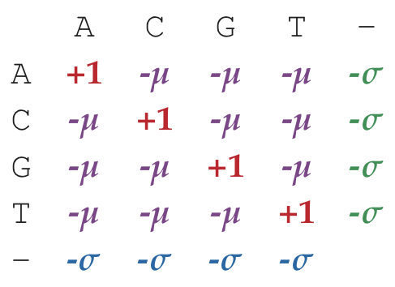
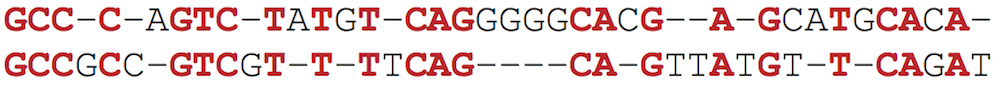
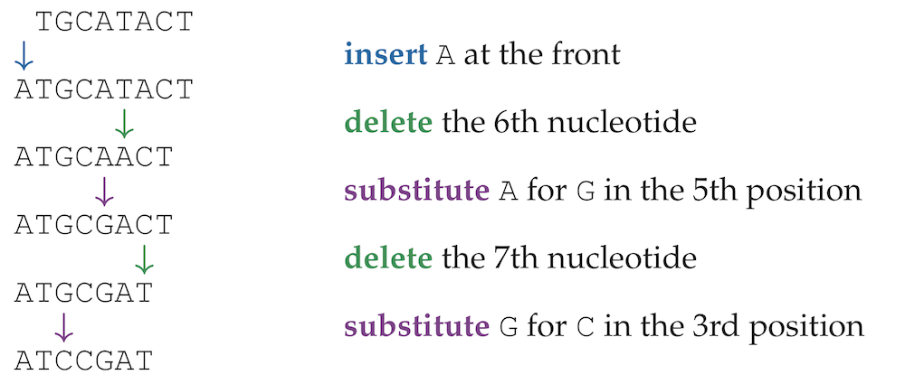
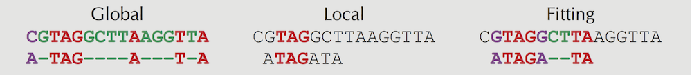

# How do we compare biological sequences

The LCS algorithm we developed previously makes it possible to introduce absord indels to sequence comparisons. With these we make alignments that are far too absord to resemeble that which exist in biological systems.

Apart from rewarding matches as we did previously, we need a way of penalizing insertion and deletions (indels) as well as mismatches.

### Scoring matrices
We would still award +1 to __matches__, but also we would penalize __mismatches__ by a positive constant __μ__ (the __mismatch penalty__) and indels by some positive constant __σ__ (the __indel penalty__)


In this example, we set the parameters, μ = 1 and σ = 2, hence the score assigned is __-4__.




Biologists have refined this further to allow for the fact that some mutations are more probable than others hence leading to mismatches and different indel penalties. With this, we would use a (k+1) x (k+1) __scoring matrix__ holding the scores of aligning k number of different symbols.

An example scoring matrix for DNA might look like 



   
An example of such scoring matrix is __PAM Scoring Matrices__ (Percentage Allowed Mutation scoring matrices for amino acids)

### Global Alignment
__Global Alignment Problem:__ Find a highest-scoring alignment of two strings as defined by a scoring matrix.  
__Input:__ Two strings and a scoring matrix Score.  
__Output:__ An alignment of the strings whose alignment score (as defined by Score) is maximized over all alignments of the strings.

[Solution](./global_alignment.py)

### Local Alignment
The limitation of global alignment is that it does not help to reveal biologically relevant similarities. For example, the __homoebox genes__ responsible for regulating embryonic development are long and greatly differ in species but possess a highly conserved 60-amino acid-long region called the __homeodomain__.

This highly conserved region can be found using another algorithm called __Local Aligment__. Local alignment seeks to find a section within the two sequences with the highest alignment score

  
An example is the global alignment between these two sequences having 22 matches, 18 indels and 2 mismatches resulting in a score 22 - 18 - 2 = 2 (if σ = μ = 1).


  
However with a different alignment, though we get a score of -15 for all the sequences, we are able to find a subset of the sequences that are higly conserved with a score of 10 


**Solve the Local Alignment Problem.**  
__Input:__ Two protein strings written in the single-letter amino acid alphabet.  
__Output:__ The maximum score of a local alignment of the strings, followed by a local alignment of these strings achieving the maximum score. Use the PAM250 scoring matrix for matches and mismatches as well as the indel penalty σ = 5.  
[Solution](./local_alignment.py)


### Edit distance
The number of deletions, insertions and/or substitions needed to transform one string to another.  

[Solution](./edit_distance.py)  
The edit distance between TGCATACT and ATCCGAT is 5:  



### Fitting Alignment
This is used to align sequences against a longer reference sequence. It involves finding a substring of the reference string that maximizes the global alignment score between the string and the subsequence. 
  

**Figure:** Global, local, and fitting alignments. Black symbols do not contribute to the local and fitting alignments and are only shown to illustrate flanking regions.
  
__Solve the Fitting Alignment Problem__  
**Input:** Two nucleotide strings v and w, where v has length at most 1000 and w has length at most 100.  
**Output:** A highest-scoring fitting alignment between v and w. Use the simple scoring method in which matches count +1 and both the mismatch and indel penalties are 1.  


### Overlap Alignment
This is the alignment of a suffix of one string with the prefix of another.

```
ATGCATGCCGG
     T-CC-GAAAC
```
  
**Construct a highest-scoring overlap alignment between two strings.**  
**Input:** Two strings and a matrix score.  
**Output:** A highest-scoring overlap alignment between the two strings as defined by the scoring matrix score.  
[Solution](./overlap_alignment.py)gi